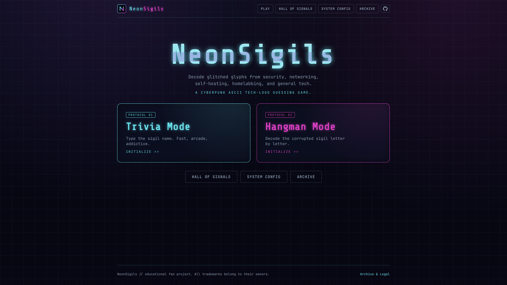
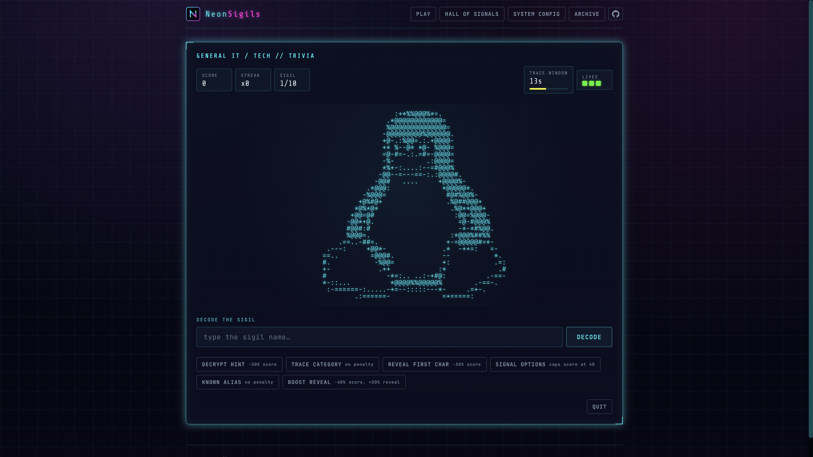
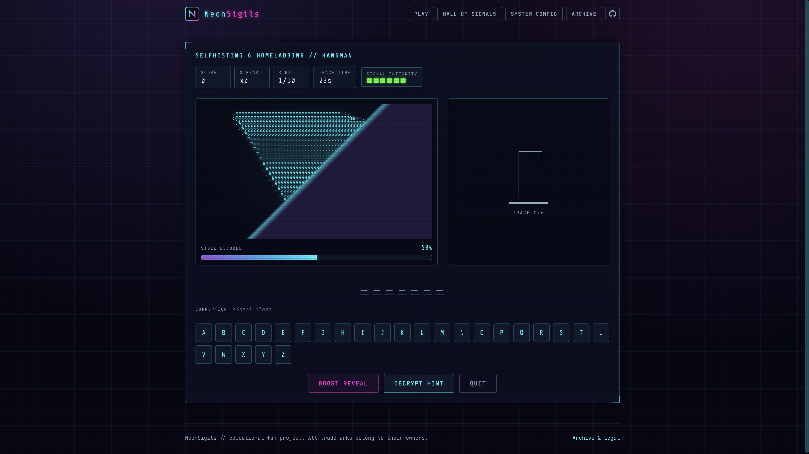

# NeonSigils

**A cyberpunk ASCII tech-logo guessing game.**
Decode glitched glyphs from security, networking, self-hosting, homelabbing, IT, and general tech.

[](https://atahan99.github.io/NeonSigils/)
[](./LICENSE)
[](#tech-stack)

NeonSigils transforms familiar technology logos into distorted ASCII sigils.
Players recognize tools, platforms, frameworks, services, and brands across
security, networking, self-hosting, homelabbing, and general IT. It ships a fast
Trivia mode, a progressive-reveal Hangman mode, category-based play, difficulty
levels, run modifiers, a local leaderboard, and a neon terminal interface. It is
fully static and works offline once built.

**Play it:** [https://atahan99.github.io/NeonSigils/](https://atahan99.github.io/NeonSigils/)

## Screenshots

| Home | Trivia | Hangman |
| --- | --- | --- |
|  |  |  |
---

## Features

- Two game modes: **Trivia** (type the name) and **Hangman** (decode letter by letter).
- **333 logos** across three categories plus a **Mixed / Chaos** play option.
- Four difficulties (Easy / Medium / Hard / Expert) that genuinely change the puzzle: a per-question **countdown timer**, autocomplete generosity, Hangman lives / starting reveal / reveal-per-letter, word-length masking, and scoring multipliers.
- Run **modifiers**: **Sudden Death** (1 life), **Time Attack** (60s, endless), and a deterministic **Daily Challenge** (same sigils for everyone each day).
- Hangman shows the clean ASCII logo behind a diagonal mask that recedes only on correct letters; on Expert it slowly **re-encrypts while idle**.
- End-of-run **grade (S–D)** with perfect-run and clean-run bonuses.
- Answer normalization with alias matching, autocomplete, a second attempt, and near-miss ("1 char off") feedback.
- Hints (text, category, first-letter, multiple-choice, alias, reveal) with score penalties.
- Local leaderboard (LocalStorage) with multiple views, JSON export, and clear-with-confirm.
- Settings: sound, animation intensity, scanlines, reduced motion, autocomplete, difficulty, round length, player name.
- Cyberpunk neon design system: CRT scanlines, glitch, flicker, animated borders, monospace type.
- Accessibility: keyboard play, labelled controls, reduced-motion support, screen-reader text for ASCII art.

## Game modes

- **Trivia** — one ASCII sigil is shown; type the brand/tool name before the countdown runs out. Faster answers score more (100 / 80 / 60 / 40 by time bucket), with streak bonuses and difficulty multipliers.
- **Hangman** — guess letters to decode the sigil; correct letters recede the mask (reveal scales by difficulty) and wrong letters cost Signal Integrity and build the gallows. Solve for a base bonus plus remaining-life and fast-solve bonuses.

## Categories

- `security-networking` (105) — Nmap, Wireshark, Burp Suite, Kali Linux, Metasploit, OWASP ZAP, Hak5, Flipper Zero, Hashcat, Hack The Box, WireGuard, pfSense, CrowdStrike, Shodan, and more pentest, VPN, firewall, and identity tooling.
- `selfhosting-homelab` (90) — Docker, Portainer, Proxmox, Home Assistant, Jellyfin, Nextcloud, Pi-hole, Sonarr, Radarr, Grafana, Uptime Kuma, and the wider *arr / homelab stack.
- `general-it-tech` (138) — GitHub, React, Next.js, Python, TypeScript, Kubernetes, Microsoft, Google, Spotify, NVIDIA, Steam, Ubuntu, Debian, Arch Linux, and other major dev stacks, tech brands, Linux distros, and gaming hardware.

Ships **333 logos** sourced and rasterized at build time. Each category lives in
its own file under `src/data/logos/` so the set can keep growing. Some brands
appear in only one category even if defined in multiple source files (see
`OWNER_OVERRIDE` in `src/data/logoSources.ts`).

**Full icon archive (333)**

### Security & Networking (105)

AdGuard · Aircrack-ng · Auth0 · Authelia · authentik · Bash Bunny · Binwalk · Bitdefender · Bitwarden · BloodHound · Brave · Burp Suite · Check Point · Cilium · Cisco · Cloudflare · CrowdStrike · Cryptomator · Datadog · DuckDuckGo · Duo Security · Elastic · F5 · Falco · Fastly · ffuf · Firefox · Flipper Zero · Fortinet · Ghidra · GnuPG · Gobuster · Graylog · Hack The Box · Hak5 · HAProxy · Hashcat · Headscale · John the Ripper · Juniper Networks · Kali Linux · Kaspersky · KeePassXC · Keycloak · Kibana · LastPass · Let's Encrypt · LibreWolf · Maltego · Malwarebytes · Masscan · Metasploit · MikroTik · mitmproxy · Mullvad · NetBird · Netgear · Nikto · Nmap · Nuclei · O.MG Cable · Okta · OpenSSL · OpenVPN · OpenWrt · OPNsense · OWASP ZAP · Palo Alto Networks · Parrot OS · pfSense · Proton VPN · Qualys · Qubes OS · Radare2 · Shodan · Signal · Snort · Snyk · SonarQube · SonicWall · Sophos · Splunk · sqlmap · Tails · Tailscale · Tenable · THC-Hydra · Tor · TP-Link · Trivy · TryHackMe · Twingate · Ubiquiti · USB Rubber Ducky · Vault · VirusTotal · Wazuh · WiFi Pineapple · WireGuard · Wireshark · Wiz · WPScan · YubiKey · ZeroTier · Zitadel

### Selfhosting & Homelabbing (90)

AdGuard Home · Audiobookshelf · Bazarr · Beszel · Blocky · BookStack · BorgBackup · Caddy · Calibre-Web · CasaOS · Cloudflare Tunnel · Cockpit · Docker · Dockge · Duplicati · Eclipse Mosquitto · Emby · ESPHome · File Browser · Firefly III · Forgejo · FreshRSS · Frigate · Ghost · Gitea · Glances · Gotify · Grafana · Heimdall · Homarr · Home Assistant · Homepage · Immich · InfluxDB · Invidious · Jellyfin · Jellyseerr · Jitsi · Joplin · Kavita · Kopia · LibreNMS · Lidarr · Matomo · Mattermost · Mealie · MinIO · Navidrome · Netdata · Nextcloud · Nginx · Nginx Proxy Manager · Node-RED · ntfy · NZBGet · Obsidian · OpenMediaVault · Paperless-ngx · PhotoPrism · Pi-hole · Piwigo · Plex · Portainer · Prometheus · Prowlarr · Proxmox · qBittorrent · Radarr · Runtipi · SABnzbd · Seafile · Sonarr · Stirling PDF · Syncthing · Tautulli · Technitium DNS · Traefik · Transmission · Trilium Notes · TrueNAS · Umami · Unbound · Unraid · Uptime Kuma · Vaultwarden · Vikunja · Watchtower · Wiki.js · Zabbix · Zigbee2MQTT

### General IT / Tech (138)

Adobe · Affinity · AlmaLinux · Amazon Web Services · AMD · Android · Angular · Ansible · Apple · Arch Linux · Astro · ASUS ROG · Atlassian · Binance · Bootstrap · Bun · C++ · CachyOS · CentOS · Coinbase · Corsair · CSS3 · Dart · DaVinci Resolve · Debian · Dell · Deno · Discord · Django · Dropbox · Elasticsearch · Elgato · Epic Games · ESLint · Express · Facebook · Fedora · Figma · Firebase · Flask · FreeBSD · Git · GitHub · GitHub Actions · GitLab · GNOME · Go · Google · Google Cloud · GraphQL · HP · HTML5 · Instagram · Intel · Java · JavaScript · Jenkins · Jira · jQuery · KDE · Kotlin · Kubernetes · Laravel · Lenovo · LinkedIn · Linux · Linux Mint · Logitech · MariaDB · Meta · Microsoft · MongoDB · MSI · MySQL · Neovim · Netflix · Netlify · Next.js · Node.js · Notion · npm · Nuxt · NVIDIA · Oculus · Oracle · PayPal · PHP · PlayStation · Podman · PostgreSQL · Prettier · Prisma · Proton · Python · PyTorch · React · Red Hat · Reddit · Redis · Redux · Rocky Linux · Ruby · Ruby on Rails · Rust · Salesforce · Samsung · Sass · Shopify · Slack · Spotify · Spring Boot · SQLite · Steam · Stripe · Supabase · Svelte · Swift · Tailwind CSS · TCL · Telegram · TensorFlow · Terraform · Tesla · TikTok · Twitch · TypeScript · Ubuntu · Valve · Vercel · Vite · Vue.js · Webpack · WhatsApp · X · Xbox · Yarn · YouTube · Zoom


## Tech stack

- [Vite](https://vitejs.dev/) + [React](https://react.dev/) + TypeScript
- Plain CSS + CSS variables + CSS Modules (no UI framework)
- LocalStorage for settings and leaderboard
- Static generated TypeScript data (`src/data/logos.generated.ts`)
- Node.js build-time scripts for SVG → ASCII generation (`sharp`, `simple-icons`)
- No backend, no accounts, no network at runtime

## Local development

```bash
npm install
npm run dev        # start the dev server
npm run build      # typecheck + production build to dist/
npm run preview    # preview the production build
```

## Deployment

The build is a static `dist/` folder (Vite `base: "./"`, so it works from any
subpath). Deploy to GitHub Pages, Netlify, Vercel, or Cloudflare Pages:

```bash
npm run build
# then serve / upload the dist/ directory
```

Routing is internal state-based (no router), so no SPA redirect/404 config is needed.

## Adding new logos

1. Add an entry to the relevant category file under `src/data/logos/` (`security.ts`, `selfhosting.ts`, or `general.ts`), which are aggregated in `[src/data/logoSources.ts](src/data/logoSources.ts)`:
  - `id`, `name`, `aliases`, `category`, `difficulty`, `tags`, `hints` (≥ 2), and
  - `sourceCandidates`: an ordered fallback chain, e.g.
    ```ts
    sourceCandidates: [
      { provider: "theSVG", slug: "brandslug", variant: "mono" },
      { provider: "simpleicons", slug: "brandslug" },
      { provider: "manual", slug: "brandslug" },
    ]
    ```
2. Run the asset pipeline (below).
3. Validate: `npm run validate-logos`.

## Icon sources & the resolver

Logos are resolved at **build time only** by `scripts/fetch-icons.ts`, trying
each `sourceCandidates` entry in order:

1. **[theSVG](https://thesvg.org/)** — a pre-fetched override SVG in `scripts/svg-thesvg/<slug>.svg`.
2. **[Simple Icons](https://simpleicons.org/)** — the offline `[simple-icons](https://www.npmjs.com/package/simple-icons)` npm package, by slug.
3. **[dashboard-icons](https://github.com/homarr-labs/dashboard-icons)** — the [homarr-labs/dashboard-icons](https://github.com/homarr-labs/dashboard-icons) CDN (build-time fetch), for self-hosted brands.
4. **[selfh.st/icons](https://selfh.st/icons/)** — the [selfhst/icons](https://github.com/selfhst/icons) CDN (build-time fetch), broad self-hosted + some security coverage.
5. **manual** — a hand-authored SVG in `[scripts/svg-manual/<slug>.svg](scripts/svg-manual/)` (last resort; see `[scripts/svg-manual/README.md](scripts/svg-manual/README.md)`; e.g. `nmap`, `hashcat`, `flipperzero`, `hak5`).

The resolved SVGs are cached in `scripts/svg/` with provenance in
`scripts/.cache/provenance.json`. The deployed game never fetches any of this.

### Using theSVG MCP during development

[theSVG](https://thesvg.org/) icons are the preferred source. During development, use the theSVG MCP
to fetch a brand's **mono** variant and save it as an override:

1. Search: `search_icons({ query: "wireshark" })` to find the slug.
2. Fetch: `get_icon({ slug: "wireshark", variant: "mono" })`.
3. Save the returned `<svg>…</svg>` to `scripts/svg-thesvg/wireshark.svg`.
4. Ensure the logo's `sourceCandidates` lists `{ provider: "theSVG", slug: "wireshark", variant: "mono" }` first.
5. Re-run the pipeline. The resolver will now prefer the theSVG asset.

Prefer `mono` (it converts to ASCII cleanly). Use `default` only if the mono
silhouette is unavailable or less recognizable. Avoid wordmark variants.

## Generating ASCII assets

```bash
npm run fetch-icons      # resolve SVGs -> scripts/svg/ + provenance
npm run generate-ascii   # rasterize (sharp) -> src/data/logos.generated.ts
npm run validate-logos   # data-integrity checks
# or all three:
npm run assets
```

Generation is deterministic (seeded by logo id), so ASCII is stable across
builds. ASCII variants produced per logo: `clean`, `glitched`, `cropped`,
`lowRes`, and `revealStages` (progressive reveal frames for Hangman). Grid width
scales with difficulty (Easy ~56 cols → Expert ~28 cols); harder logos use a
shorter, noisier character ramp.

If the pipeline has not been run, the app falls back to the hand-authored
`src/data/sampleLogos.ts` so it is always playable.

## Legal / trademark disclaimer

NeonSigils is an educational / fan-made tech-logo guessing game. All brand  
names, logos, and trademarks belong to their respective owners. NeonSigils is  
not affiliated with, endorsed by, or sponsored by any of those brands. Logos are  
transformed into ASCII art for quiz, recognition, and educational purposes.  
Per-icon license/trademark metadata is stored in each entry's `source` field  
where available. Brand logos are not used as the app icon, merchandise, or  
branding identity — NeonSigils uses its own original sigil symbol. Assets marked  
"No Derivatives" (or similar) are avoided. See the in-app **Archive / Legal**  
page for details.

## Project structure

```
neon-sigils/
  scripts/            # build-time SVG -> ASCII pipeline (dev only)
    fetch-icons.ts    # multi-source resolver
    generate-ascii.ts # sharp rasterizer -> logos.generated.ts
    validate-logo-data.ts
    lib/svgToAscii.ts
    svg-thesvg/       # theSVG MCP overrides
    svg-manual/       # hand-authored fallbacks
  src/
    components/       # layout/, game/, hangman/
    data/             # categories, logoSources, logos/ (per-category sources), logos.generated, sampleLogos
    hooks/            # useGameSession, useSettings
    pages/            # 9 screens
    styles/           # globals / neon / animations
    types/            # logo, game, leaderboard
    utils/            # normalizeAnswer, scoring, random, hints, gameSession, ...
```

